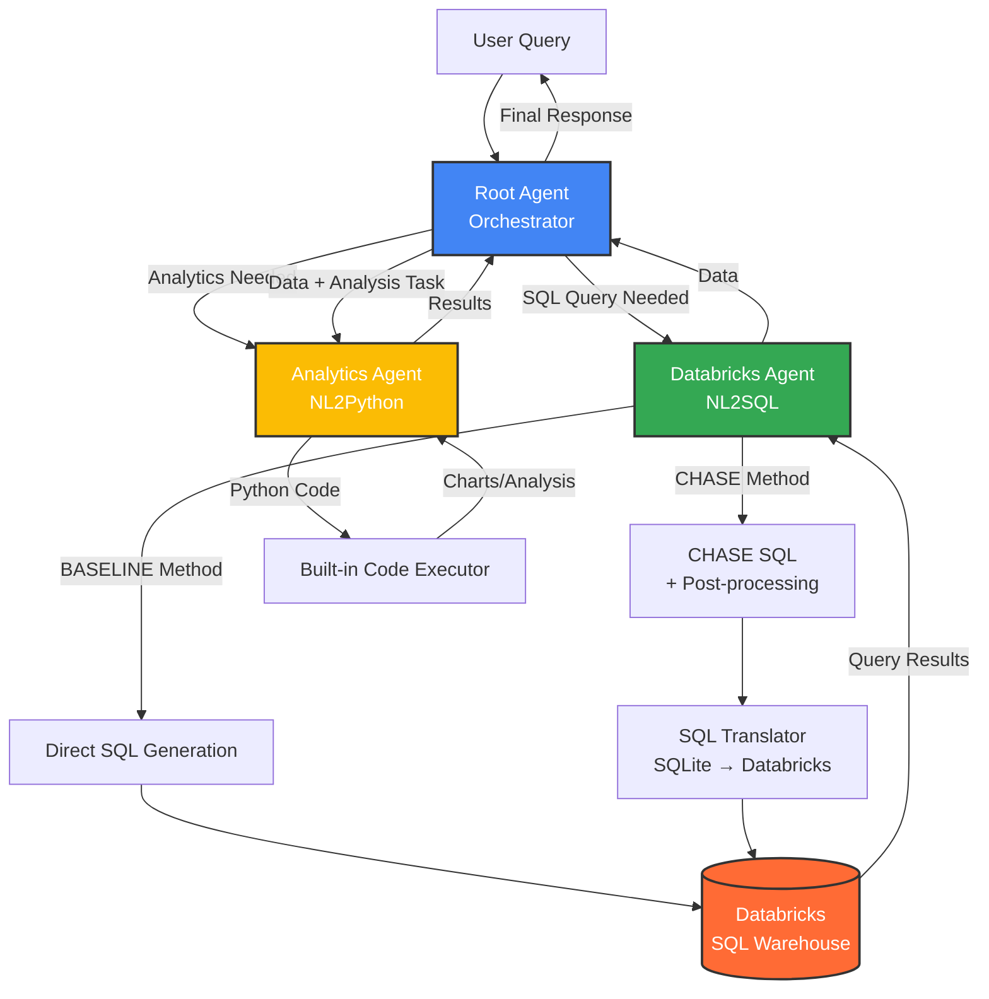
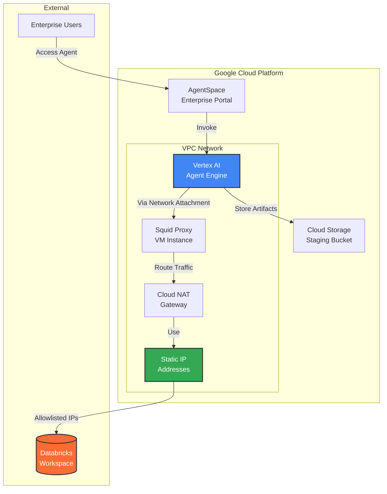

# Databricks AgentSpace Agent

A multi-agent system built with Google's Agent Development Kit (ADK) that enables natural language interactions with Databricks data through SQL queries and advanced analytics. The system is deployed on Google Cloud's Vertex AI Agent Engine and integrated with AgentSpace for enterprise discovery.

## 🌟 Features

- **Natural Language to SQL (NL2SQL)**: Convert natural language questions into SQL queries for Databricks
- **Advanced Analytics**: Perform data science tasks using Python code execution
- **Multi-Agent Architecture**: Orchestrated system with specialized agents for different tasks
- **Secure Authentication**: OAuth M2M (Machine-to-Machine) authentication with Databricks
- **Static IP Support**: Network configuration with static IPs for allowlisting in Databricks
- **Enterprise Integration**: Deployed to Google AgentSpace for organization-wide access
- **Two NL2SQL Methods**: 
  - **BASELINE**: Direct LLM-based SQL generation
  - **CHASE**: Advanced SQL generation with post-processing and error correction

## 🏗️ Architecture

### Multi-Agent System



### Infrastructure Architecture



### Component Breakdown

1. **Root Agent** (`agent/agent.py`)
   - Orchestrates the multi-agent system
   - Classifies user intent
   - Routes queries to appropriate sub-agents
   - Formats final responses in Portuguese (pt-BR)

2. **Databricks Agent** (`agent/sub_agents/databricks/agent.py`)
   - Converts natural language to SQL
   - Executes queries against Databricks SQL Warehouse
   - Supports two NL2SQL methods:
     - **BASELINE**: Direct LLM-based generation
     - **CHASE**: Advanced generation with SQL post-processing

3. **Analytics Agent** (`agent/sub_agents/analytics/agent.py`)
   - Performs data analysis using Python
   - Generates visualizations and statistical analysis
   - Uses built-in code executor for safe execution

4. **CHASE SQL System** (`agent/sub_agents/databricks/chase_sql/`)
   - Advanced NL2SQL with multi-step reasoning
   - SQL translation (SQLite → Databricks)
   - Error correction before and after translation

## 📋 Prerequisites

### Google Cloud Platform
- GCP Project with billing enabled
- Required APIs enabled:
  - Vertex AI API
  - Compute Engine API
  - Service Networking API
  - Cloud DNS API
- Appropriate IAM permissions for:
  - Vertex AI Agent Engine
  - Cloud Storage
  - VPC Network management
  - Compute Engine

### Databricks
- Databricks workspace (AWS, Azure, or GCP)
- SQL Warehouse configured and running
- Service Principal with OAuth M2M credentials
- Catalog and schema access permissions

### Local Development
- Python 3.10+
- Terraform 1.0+
- gcloud CLI configured
- Git

## 🚀 Installation & Setup

### 1. Clone the Repository

```bash
git clone https://github.com/jcsn13/databricks-agentspace-agent.git
cd databricks-agentspace-agent
```

### 2. Configure Databricks OAuth M2M

Create a Service Principal in Databricks:

1. Go to Databricks Admin Console → Service Principals
2. Create a new Service Principal
3. Generate OAuth credentials (Client ID and Secret)
4. Grant necessary permissions to catalogs/schemas
5. Note the SQL Warehouse HTTP path

### 3. Configure Terraform Variables

Copy the example configuration:

```bash
cd terraform
cp terraform.tfvars.example terraform.tfvars
```

Edit `terraform.tfvars` with your values:

```hcl
# GCP Configuration
project_id                    = "your-gcp-project-id"
region                        = "us-central1"
google_cloud_storage_bucket   = "your-agent-staging-bucket"

# AgentSpace Configuration
agentspace_app_id            = "your-agentspace-app-id"
agent_display_name           = "Databricks Agent"
agent_description            = "Agent para queries no Databricks com análise avançada"

# Databricks OAuth M2M Configuration
databricks_client_id         = "your-service-principal-client-id"
databricks_client_secret     = "your-service-principal-secret"
databricks_host              = "https://your-workspace.cloud.databricks.com"
databricks_sql_warehouse_path = "/sql/1.0/warehouses/your-warehouse-id"
databricks_catalog           = "your-catalog"
databricks_schema            = "your-schema"

# Model Configuration
root_agent_model             = "gemini-2.0-flash-exp"
databricks_agent_model       = "gemini-2.0-flash-exp"
analytics_agent_model        = "gemini-2.0-flash-exp"

# NL2SQL Method: "BASELINE" or "CHASE"
nl2sql_method                = "BASELINE"
```

### 4. Install Python Dependencies

```bash
pip install -r requirements.txt
```

## 🌐 Deployment

### Deployment Process Flow


### Infrastructure Deployment with Terraform

1. **Initialize Terraform**:

```bash
cd terraform
terraform init
```

2. **Review the deployment plan**:

```bash
terraform plan
```

3. **Deploy infrastructure**:

```bash
terraform apply
```

This will create:
- VPC network and subnet
- Cloud NAT gateway with static IPs
- Network attachment for Private Service Connect
- Squid proxy VM for traffic routing
- All necessary firewall rules

4. **Automatic Agent Deployment**:

Terraform automatically triggers the Python deployment script which:
- Deploys the agent to Vertex AI Agent Engine
- Configures network attachment for static IP support
- Registers the agent in AgentSpace
- Saves deployment state for management

### Manual Agent Deployment (Optional)

If you need to redeploy just the agent without infrastructure changes:

```bash
# Export environment variables from Terraform
cd terraform
export $(terraform output -json | jq -r 'to_entries[] | "\(.key)=\(.value.value)"')

# Run deployment script
cd ../deployment
python deploy.py --network-attachment
```

### Undeployment

To remove the agent and infrastructure:

```bash
# Undeploy agent from AgentSpace and Agent Engine
cd deployment
python undeploy.py

# Destroy infrastructure
cd ../terraform
terraform destroy
```

## 📊 Network Architecture Details

### Static IP Configuration

The system uses a sophisticated network setup to provide static IPs for Databricks allowlisting:

1. **VPC Network**: Isolated network for agent resources
2. **Cloud NAT**: Provides outbound internet access with static IPs
3. **Squid Proxy**: Routes agent traffic through the NAT gateway
4. **Network Attachment**: Connects Agent Engine to the VPC

**Traffic Flow**:
```
Agent Engine → Network Attachment → Squid Proxy → Cloud NAT → Static IPs → Databricks
```

### Retrieving Static IPs

After deployment, get your static IPs for Databricks allowlisting:

```bash
cd terraform
./scripts/get_static_ips.sh
```

Add these IPs to your Databricks workspace IP Access List.

## 💬 Usage

### Accessing the Agent

1. Navigate to your Agentspace app 
2. Find your Databricks Agent in the agent list
3. Start a conversation

### Example Queries

**Data Retrieval**:
```
Mostre as 10 principais viagens por distância
```

**Analytics**:
```
Crie um gráfico mostrando a distribuição de viagens por hora do dia
```

**Complex Analysis**:
```
Analise a correlação entre distância e valor da corrida e crie uma visualização
```

### Response Format

The agent returns responses in Portuguese with:
- **Resultado**: Natural language summary
- **Tabela**: Markdown table with data
- **Explicação**: SQL code used (in code block)
- **Gráfico**: Visualizations (when applicable)

## 📁 Project Structure

```
databricks-agentspace-agent/
├── agent/                          # Agent implementation
│   ├── agent.py                    # Root agent orchestrator
│   ├── prompt.py                   # Agent instructions
│   ├── tools.py                    # Agent tools
│   ├── sub_agents/                 # Specialized sub-agents
│   │   ├── databricks/             # Databricks SQL agent
│   │   │   ├── agent.py            # NL2SQL agent
│   │   │   ├── tools.py            # Databricks tools
│   │   │   ├── prompts.py          # SQL generation prompts
│   │   │   ├── oauth_utils.py      # OAuth M2M utilities
│   │   │   └── chase_sql/          # CHASE SQL system
│   │   │       ├── chase_db_tools.py
│   │   │       ├── llm_utils.py
│   │   │       └── sql_postprocessor/
│   │   └── analytics/              # Analytics agent
│   │       ├── agent.py            # Python code execution
│   │       └── prompts.py          # Analysis prompts
│   └── utils/                      # Utility functions
│       └── utils.py
├── deployment/                     # Deployment scripts
│   ├── deploy.py                   # Agent deployment
│   └── undeploy.py                 # Agent removal
├── terraform/                      # Infrastructure as Code
│   ├── main.tf                     # Main configuration
│   ├── variables.tf                # Variable definitions
│   ├── agent_deployment.tf         # Agent deployment
│   ├── network_attachment.tf       # PSC configuration
│   ├── nat.tf                      # NAT gateway
│   ├── proxy.tf                    # Squid proxy VM
│   ├── firewall.tf                 # Firewall rules
│   └── scripts/
│       └── get_static_ips.sh       # IP retrieval script
├── requirements.txt                # Python dependencies
└── README.md                       # This file
```

## ⚙️ Configuration

### Environment Variables

The deployment script uses these environment variables (set by Terraform):

```bash
# Google Cloud
GOOGLE_CLOUD_PROJECT=your-project-id
GOOGLE_CLOUD_LOCATION=us-central1
GOOGLE_CLOUD_STORAGE_BUCKET=your-bucket

# Databricks OAuth M2M
DATABRICKS_HOST=https://your-workspace.cloud.databricks.com
DATABRICKS_CLIENT_ID=your-client-id
DATABRICKS_CLIENT_SECRET=your-client-secret
DATABRICKS_SQL_WAREHOUSE_PATH=/sql/1.0/warehouses/id
DATABRICKS_CATALOG=your-catalog
DATABRICKS_SCHEMA=your-schema

# Agent Models
ROOT_AGENT_MODEL=gemini-2.5-flash
DATABRICKS_AGENT_MODEL=gemini-2.5-flash
ANALYTICS_AGENT_MODEL=gemini-2.5-flash
BASELINE_NL2SQL_MODEL=gemini-2.5-flash

# NL2SQL Method
NL2SQL_METHOD=BASELINE  # or CHASE

# Network (set by Terraform)
NETWORK_ATTACHMENT_ID=projects/.../networkAttachments/...
STATIC_IPS=ip1,ip2,ip3,ip4
PROXY_INTERNAL_IP=10.0.0.x
```

### NL2SQL Methods

**BASELINE Method**:
- Direct LLM-based SQL generation
- Faster response times
- Good for standard queries

**CHASE Method**:
- Multi-step SQL generation
- SQL translation and error correction
- Better for complex queries
- Configurable post-processing options

To switch methods, update `nl2sql_method` in `terraform.tfvars` and redeploy.

## 🔧 Development

### Local Testing

1. Set up environment variables:
```bash
export DATABRICKS_HOST=...
export DATABRICKS_CLIENT_ID=...
export DATABRICKS_CLIENT_SECRET=...
# ... other variables
```

2. Run the agent locally:
```python
from agent.agent import runner

# Test a query
response = runner.run("Mostre as tabelas disponíveis")
print(response)
```

### Adding Custom Tools

Add new tools in `agent/tools.py`:

```python
async def my_custom_tool(
    parameter: str,
    tool_context: ToolContext,
) -> str:
    """Tool description"""
    # Implementation
    return result
```

Register in `agent/agent.py`:

```python
root_agent = Agent(
    # ...
    tools=[
        call_db_agent,
        call_ds_agent,
        my_custom_tool,  # Add here
    ],
)
```

## 🐛 Troubleshooting

### Common Issues

**1. Static IPs not working**
- Verify proxy is running: `gcloud compute instances list`
- Check proxy logs: `gcloud compute ssh proxy-vm --command "sudo journalctl -u squid -f"`
- Verify environment variables are set in Agent Engine

**2. Databricks authentication fails**
- Verify OAuth credentials are correct
- Check service principal has necessary permissions
- Ensure SQL Warehouse is running

**3. Agent deployment fails**
- Check all required APIs are enabled
- Verify IAM permissions
- Review deployment logs in Cloud Logging

**4. Network attachment issues**
- Ensure VPC and subnet are created
- Verify network attachment is in the same region
- Check firewall rules allow necessary traffic

### Connectivity Testing

The Databricks agent includes automatic connectivity testing on first setup. Check logs for:
- ✅ OAuth token acquisition
- ✅ SQL Warehouse connectivity
- ✅ Static IP verification

## 📝 License

Copyright 2025 Google LLC

Licensed under the Apache License, Version 2.0 (the "License");
you may not use this file except in compliance with the License.
You may obtain a copy of the License at

    http://www.apache.org/licenses/LICENSE-2.0

Unless required by applicable law or agreed to in writing, software
distributed under the License is distributed on an "AS IS" BASIS,
WITHOUT WARRANTIES OR CONDITIONS OF ANY KIND, either express or implied.
See the License for the specific language governing permissions and
limitations under the License.

